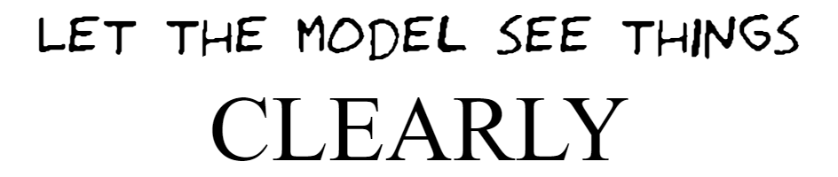
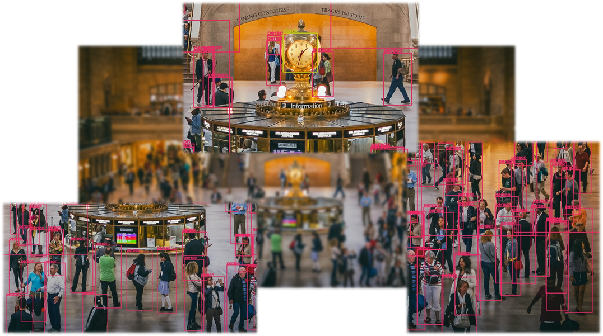

# Strided Inference: for small object detection in high resolution images     





###  [Link to Bi2i article](https://bridgei2i.com/strided_inferencing.com) | [Our arXiv paper](https://arxiv.org/abs/_____) | [Link to medium article on use case](https://amitamola.medium/Strided_inference) 

## Requirements
```bash
$ pip install -r requirements.txt
```


## 1. Using strided inference with a pre-trained model
```
>>> from stridedInference.stridedInference import stridedInference
>>> img_name = 'img.jpg'
>>> image = cv2.imread(f'openCV_dnn/{img_name}')

>>> detections = stridedInference(image, img_name, detector, tile_size_info=(900, 700, 701), nms_th=0.95)
```

## 2. To generate tiles for training new model 
The key use case of this module is to make use of Strided Inferencing with a pre-trained model, yet for lot of cases
there might be a need to train a new model on tiled images. We provide a submodule that performs this
task and outputs tiled images and new tiled CSV(containing annotations) for your new model training.

```
>>> from tiler_with_annotations import tile_for_training
>>> ob = tile_for_training()
>>> ob.tiler_with_annotations(image_folder_path, annotation_csv_path,  output_directory_path, tile_size_information)
```


## 3. Example 
Below we can see results of using OpenCV’s DNN module’s ssd_mobilenet network object detection with and without strided inference:

### Figure  1: Stock image(5306 x 2985) of a substation with a big crowd


### Figure 2: Result of running object detector with low confidence


### Figure 3: Detections using strided inference using 900 pixel tiles and NMS of 0.95


## Acknowledgement

This code base is partially based on a brilliant paper published in [CVF](https://openaccess.thecvf.com/content_CVPRW_2019/papers/UAVision/Unel_The_Power_of_Tiling_for_Small_Object_Detection_CVPRW_2019_paper.pdf). 
We sincerely would like to thank Unel, Ozkalaycı and Cıgla for their work.


Primary Author
==============

* __Amit Amola [Github](https://github.com/amitamola), [LinkedIn](https://www.linkedin.com/in/amitamola/)__

    [@amit_amola](https://twitter.com/amit_amola) is the current maintainer of the 
	code and has written much of the current code base, including a complete refactor 
	of the core for open source version. He has been part of Bridgei2i since 2018 and 
	currently works as Senior Analytics Consultant at AI Labs.

Other Contributors
==================

The incomplete list of individuals below have provided patches or otherwise
contributed to the project prior to the project being hosted on GitHub/Bitbucket. 
We would like to thank everyone who has contributed to the project in any way.

* [Anil Prasad MN](https://www.linkedin.com/in/anilprasadmn/)
* [Sreekiran A R](https://www.linkedin.com/in/sreekiranar/)
* [Divyansh Mishra](https://www.linkedin.com/in/dimishhra/)
* [Shreyas HV](https://www.linkedin.com/in/shreyas-h-v-78215b160/)
* Shaik Javed Hussian

Queries and contribution
========================
If someone has any queries, one can connect to us via email- amitamola.dun@gmail.com
Feel free to contribute to the project and raise pull request for the same.
